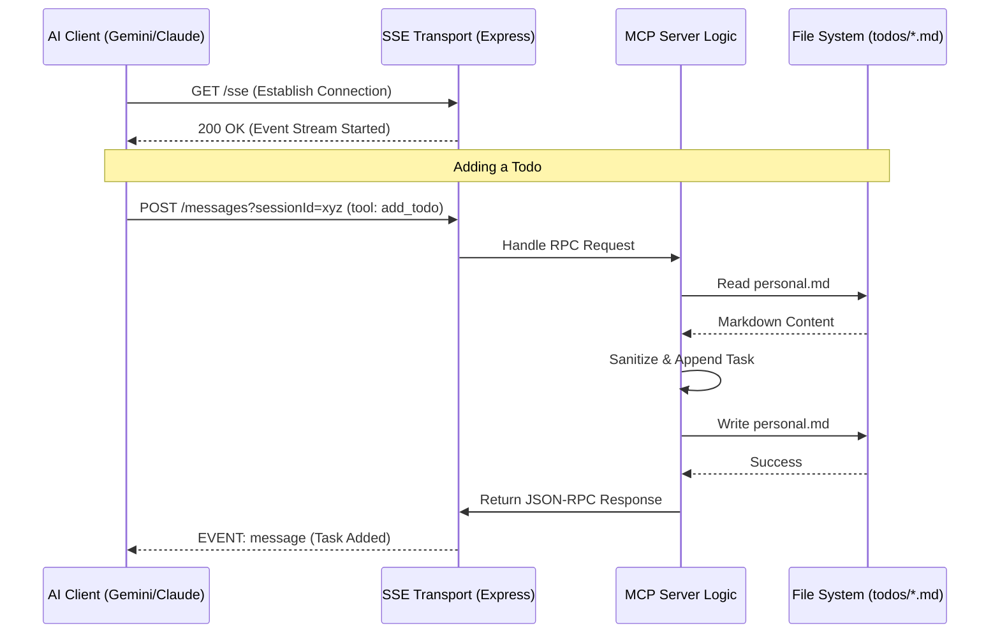

# Productivity Workspace

A centralized, category-based personal productivity system designed for AI integration and cross-device sync.

## Architecture & Call Flow

This server uses the **Model Context Protocol (MCP)** via **Server-Sent Events (SSE)**. Below is a sequence diagram illustrating how a task is added from an AI client.

## Why
This workspace was created to move away from a single monolithic `todo.md` file towards a modular, AI-accessible system via the Model Context Protocol (MCP). It allows for better organization of different areas of life (Boozang, Career, Personal) and enables future remote interaction via a deployed MCP server.

## What
- **Modular To-Dos**: Tasks split into logical categories in the `todos/` directory.
- **MCP Server**: A Node.js-based server implementing the Model Context Protocol for secure, remote task management.
- **Infrastructure**: Management scripts and Docker support for production-ready deployment.
- **Knowledge Base**: Project-specific context and deep-links in the `brain/` directory.

## How
- **Task Management**: Edit `.md` files in `todos/` directly or use the MCP tools.
- **MCP Integration**: Connect an MCP client (like Gemini or a mobile app) to the SSE endpoint.
- **Local Dev**: Use `./mcp-server/start.sh` to get the server running locally on port 3000.

## Directory Structure
- `todos/`: Category-specific Markdown to-do files and index.
- `mcp-server/`: Node.js server exposing tasks to AI clients.
- `brain/`: Knowledge base and project context.
- `backlog.md`: High-level goals and project roadmap.
- `journal/`: Daily notes and logs.
- `.agent/`: Custom AI instructions and workspace settings.

## Usage Scripts
### MCP Server (in `mcp-server/`)
- `./start.sh`: Start the server in the background.
- `./stop.sh`: Stop the server.
- `./status.sh`: Check server status and logs.
- `./restart.sh`: Refresh the server.
- `node test-mcp.js`: Run connectivity verification.

## Known Issues / Limitations

- **Concurrency**: The server does not currently handle simultaneous writes to the same Markdown file. While not an issue for single-user local setups, it may cause data loss in high-concurrency environments.
- **Path Safety**: Only alphanumeric filenames are supported for categories to ensure security.
- **Simple Appending**: Tasks are appended to the end of the file. Advanced formatting (like nested lists) may be disrupted by direct manual edits if not following standard Markdown.

## Acknowledgments
- **AI Assistance**: This project was developed with the assistance of **Gemini 2.0 Flash/Pro**, which helped in architecting the MCP server, writing the Node.js implementation, and creating the documentation.
- **MCP Framework**: Built on the [Model Context Protocol](https://modelcontextprotocol.io).

## License
MIT License. See [LICENSE](LICENSE) for details.
